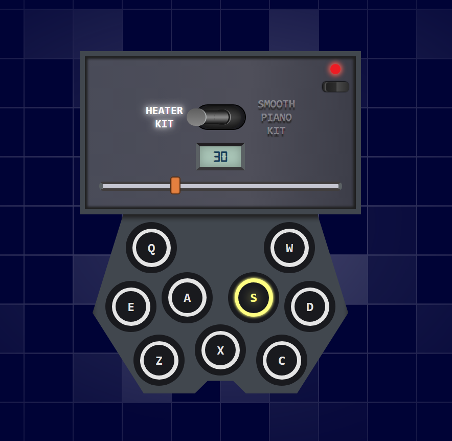

# Drum Machine

- ON/OFF button
- Volume adjustment
- 2 different sound kits
- Keyboard events to handle drum pads
- Responsive


<p align="center"><a href="https://nicole-lopez.github.io/drum-machine/">View demo</a></p>


## Table of Contents
- [Built With](#built-with)
	- [Use](#use)
- [Installation](#installation)
- [Contact](#contact)


## Built With
<div align="center">  
<span style="margin: 10px; display:inline-block">
</a>  
<p>React</p>
</span>

<span style="margin: 10px; display:inline-block">
</a>  
<p>LESS</p>
</span>
</div>

### Use
- Custom hooks 
- CSS modules


## Installation
1. Clone the repo

```sh
git clone https://github.com/Nicole-Lopez/drum-machine.git
```

2. Install dependencies

```sh
pnpm install
```


## Contact

[")](https://github.com/Nicole-Lopez)
[](www.linkedin.com/in/nicole-lopez-877878212/)